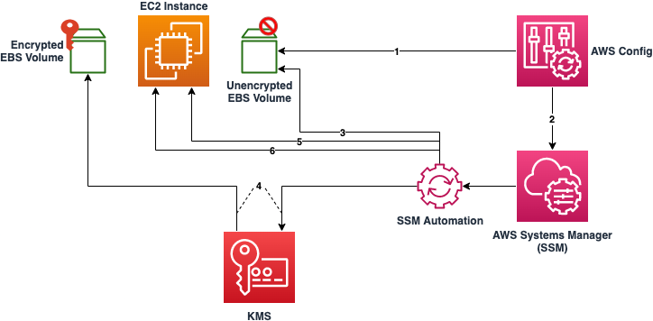

# Automatically remediate unencrypted EBS Volumes using customer KMS keys

This sample describes how to automatically remediate unencrypted EBS Volumes. Amazon EBS encrypted volumes provide an additional layer of data protection by securing your data from unauthorized access to the underlying storage. You can use Amazon EBS encryption to increase data protection of your applications deployed in the cloud, and to fulfill compliance requirements for encryption at rest.

## Prerequisites 
A workstation with both AWS CLI and jq installed. Instructions on installation can be found in the Tools section.
IAM permissions provisioned to have read and write access to CloudFormation, EC2, Systems Manager, Config, & KMS.
AWS Organizations configured with all features enabled, a requirement for Service Control Policies.
Config enabled in the target accounts ensuring there are no Config rules in your AWS accounts with the name "encrypted-volumes". This solution deploys a rule with this name. Existing Config rules with this name may result in failure on deployment.  This can also result in unnecessary charges related to processing the same rule more than once.

## Limitations
Although there is no direct way to encrypt an existing unencrypted volume or snapshot, you can encrypt them by creating either a volume or a snapshot. This pattern provides automation to remediate your unencrypted EBS volumes.
This solution encrypts all EBS volumes with the same AWS KMS customer master key (CMK).
If you choose to enable the account attribute for EBS encryption, be aware that encryption by default is a Region-specific setting. If you enable it for a Region, you cannot disable it for individual volumes or snapshots in that Region.

## Deployment
 
* A new KMS CMK will be created as part of this pattern. Identify an IAM User or Role which will be the Key Admin for the new CMK. If a new user or role needs to be created for this purpose, create it now.
    * Once identified, copy the user or role's ARN and keep it handy as it will be used during the deployment of Stack1 in the next step.
* Deploy _Stack1.yaml_ in CloudFormation. Give the stack a clear and descriptive name. Take note of the name as you will need it during the deployment of Stack2 in the next step.
    * Paste the ARN of your Key Admin into the only parameter field in Stack1. This IAM entity will be added as the Key Admin for the new CMK which the stack will create.
* Deploy the attached _Stack2.yaml_ in CloudFormation. Give the stack a clear and descriptive name.
    * For the only parameter of Stack2, enter in the Stack Name entered during the previous step for deploying Stack1. This will allow Stack2 to reference the new CMK and Role that Stack1 deployed.
* Create an EC2 instance with an unencrypted EBS volume. The instance type does not matter and access to the instance is not needed. As such, you can choose a t2.micro to stay in the free tier and there is no need to create a key pair.
    * In the AWS Console go to Services -> Config > Rules. Select the Rule ‘encrypted-volumes’. A list of non-compliant resources will be listed, including your newly-created volume. If the volume does not appear immediately, give it a few minutes. The Config rule is set to detect on resource changes, and will trigger shortly after the instance and volume are created.
    * Select the resource then click “Remediate”.
    * You can view the progress and status in Systems Manager. In the console go to “Systems Manager” -> “Automation”. Select the ‘Execution ID’ of the corresponding automation to view further details.

## Enforce Service Control Policies

Navigate to AWS Organizations and create a new Service Control Policy. Add the contents of _DenyUnencryptedEC2.json_ to the policy and save it. Apply this policy to the organization Root or any necessary OUs.

[SCP](SCP)

## Enable Default EBS Encryption

In each account and region in use, run _enable-ebs-encryption-for-account.sh_ script from your workstation.

[Bash](Bash)

## Security

See [CONTRIBUTING](CONTRIBUTING.md#security-issue-notifications) for more information.

## License

This library is licensed under the MIT-0 License. See the LICENSE file.

